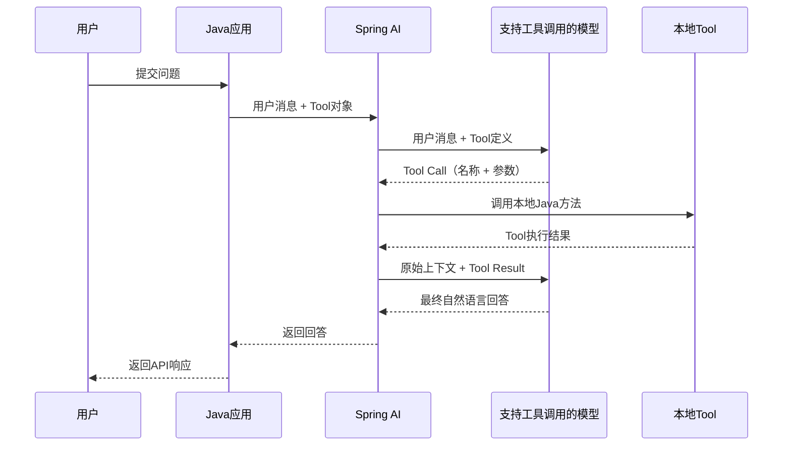

# 从 Function Calling 到 Tool：理解大模型如何调用 Java 方法

当用户问“广东今天天气怎么样”时，大模型本身并不知道实时的数据，也不能直接进入 Java 进程执行方法。
Function Calling 解决的正是这个问题：让模型在需要外部能力时，生成一份结构化的调用请求，再由应用程序执行真正的方法。

## 一、Function Calling 是什么

Function Calling（函数调用）是一种让模型请求应用程序调用外部能力的协作机制。

模型负责理解用户意图并决定：

- 是否需要调用工具；
- 应该调用哪个工具；
- 调用工具时应该提供哪些参数。

应用程序负责：

- 把允许调用的工具说明发送给模型；
- 校验模型生成的工具名称和参数；
- 执行真实的 Java 方法、HTTP 接口或数据库查询；
- 把执行结果返回给模型；
- 将模型生成的最终回答返回给用户。

因此，Function Calling 不等于“大模型直接执行 Java 方法”。模型通常只会返回类似下面的结构化请求：

```json
{
  "name": "getWeather",
  "arguments": {
    "city": "广东"
  }
}
```

Java 应用收到请求后，才会找到 `getWeather` 对应的方法并执行它。

### Function Calling 解决什么问题

普通聊天适合解释、总结和生成文本，但下面这些任务必须依赖外部能力：

- 查询天气、物流、库存和订单状态；
- 调用计算器完成精确计算；
- 查询企业数据库或业务系统；
- 创建工单、发送通知或安排日程；
- 调用本地 Java 代码完成确定性的业务逻辑。

Function Calling 把模型的语言理解能力和应用程序的真实执行能力连接起来。

### 模型和应用程序的职责边界

需要牢牢记住三个边界：

1. 模型做决策，但不直接执行本地代码。
2. 应用程序执行工具，并对权限、参数和异常负责。
3. 工具结果来自外部系统，最终自然语言回答由模型组织。

## 二、Function Calling 中的 Tool 是什么

Tool（工具）是应用程序提供给模型的一项可调用能力。
在 Java 项目中，一个 Tool 通常对应一个方法，但模型看到的不是 Java 源码，而是一份能力说明。

一份完整的 Tool 定义通常包括：

- `name`：工具的唯一名称，例如 `getWeather`；
- `description`：工具能做什么，以及应该在什么场景调用；
- `parameters`：参数名称、类型、必填规则和用途；
- `result`：工具执行后返回给模型的数据。

例如，应用程序可以把天气查询工具描述成下面的 JSON Schema：

```json
{
  "name": "getWeather",
  "description": "查询指定中国城市或省份的天气。用户询问天气、温度或是否适合出行时调用。",
  "parameters": {
    "type": "object",
    "properties": {
      "city": {
        "type": "string",
        "description": "需要查询天气的中国城市或省份名称"
      }
    },
    "required": ["city"]
  }
}
```

这份定义是一份“能力契约”：它告诉模型可以调用什么，也告诉应用程序模型应该按什么结构提交参数。

### Tool 不只是一个方法名

如果只提供名称 `getWeather`，模型仍可能无法准确判断它支持哪些地区、应该在什么场景调用。真正影响选择效果的是清晰的工具描述和参数描述。

好的描述应该说明：

- 工具负责什么；
- 什么时候应该调用；
- 什么时候不应该调用；
- 参数代表什么；
- 返回结果可能有哪些状态。

Tool 的定义越明确，模型选错工具或生成错误参数的概率通常越低。

## 三、大模型为什么知道要调用哪个 Java 方法

模型并不会扫描项目源码，也不会自动发现 Spring Bean。它之所以知道 `getWeather`，是因为应用程序在请求模型时，主动把这个工具的元数据一起发送了出去。

完整过程如下：

1. Spring AI 读取 Java 方法上的 `@Tool` 和 `@ToolParam`。
2. Spring AI 根据注解生成工具名称、描述和参数 Schema。
3. 应用程序把用户消息和可用工具列表一起发送给模型。
4. 模型根据用户意图与工具描述进行匹配。
5. 如果需要工具，模型返回工具名称和结构化参数。
6. Spring AI 根据工具名称定位本地 Java 方法并执行。

例如，用户输入：

```text
广东今天天气怎么样？
```

同时，模型收到了名为 `getWeather` 的工具说明，其中写着“用户询问天气、温度或是否适合出行时调用”。模型由此判断当前问题与该工具匹配，并生成：

```json
{
  "name": "getWeather",
  "arguments": {
    "city": "广东"
  }
}
```

模型知道的是工具契约，而不是下面这些 Java 实现细节：

- 方法属于哪个类；
- Spring Bean 如何注入；
- 方法内部查询数据库还是调用第三方 API；
- 项目的包结构和源代码。

这也是为什么未通过请求注册的 Java 方法不会被模型调用。

## 四、一次完整的 Function Calling 流程

一次有工具参与的对话，通常包含两次模型推理：第一次决定调用工具，第二次根据工具结果组织最终回答。



这个过程可以概括为：

```text
用户消息
  → 模型选择 Tool
  → 应用执行 Java 方法
  → 工具结果返回模型
  → 模型生成最终回答
```

部分框架会自动完成中间循环，因此业务代码中可能只看到一次 `.call()`，但协议层面仍然经历了工具选择、工具执行和结果回传。

## 五、Spring AI 如何定义和注册 Tool

Spring AI 可以使用 `@Tool` 声明一个工具，并用 `@ToolParam` 描述参数。

```java
import org.springframework.ai.tool.annotation.Tool;
import org.springframework.ai.tool.annotation.ToolParam;

public class WeatherTools {

    /**
     * 查询指定地区的天气。
     */
    @Tool(
            name = "getWeather",
            description = "查询指定中国城市或省份的天气。用户询问天气、温度或是否适合出行时调用。")
    public WeatherResult getWeather(
            @ToolParam(description = "需要查询天气的中国城市或省份名称") String city) {
        return queryWeather(city);
    }

    private WeatherResult queryWeather(String city) {
        return new WeatherResult(city, "晴", 26, true, "模拟天气查询成功");
    }
}
```

在发起请求时，通过 `.tools(...)` 把工具提供给模型：

```java
String answer = chatClient.prompt()
        .system("查询天气前必须调用天气工具，不要编造天气信息。")
        .user("广东今天天气怎么样？")
        .tools(new WeatherTools())
        .call()
        .content();
```

`.tools(new WeatherTools())` 的含义是“本次请求允许模型使用这些工具”，并不是执行 `WeatherTools`。

只有模型返回对应 Tool Call 后，Spring AI 才会调用 Java 方法。

### `@Tool`、系统提示词和 Java 方法分别负责什么

三者的职责不同：

- `@Tool`：告诉模型这项能力是什么、什么时候使用；
- `@ToolParam`：告诉模型参数的含义和格式；
- 系统提示词：规定对话级行为，例如“查询前必须调用工具，禁止编造”；
- Java 方法：执行真实业务逻辑并返回结果。

系统提示词能增强约束，但安全校验不能只依赖提示词。权限和参数规则必须由 Java 应用强制执行。

### 使用前提

不是所有模型和模型服务都支持 Tool Calling。使用前需要确认：

- 模型具备工具调用能力；
- 模型服务暴露兼容的工具调用协议；
- Spring AI 对应的模型适配器支持该能力；
- 模型返回的参数能够被正确反序列化。

## 六、Function Calling 与其他能力的区别

### 与普通聊天的区别

普通聊天只生成文本；Function Calling 可以生成结构化调用请求，并让应用程序执行外部能力。

### 与结构化输出的区别

结构化输出的目标是让模型按指定 JSON 格式回答。Function Calling 除了生成结构化参数，还会触发应用程序执行一个受控工具，并把结果送回模型。

### 与 RAG(检索增强生成) 的区别

RAG 主要解决“从知识库中检索相关资料，再让模型基于资料回答”的问题；

Function Calling 主要解决“让模型按需调用外部能力”的问题。

两者可以组合使用。例如把知识库检索封装成一个 `searchKnowledgeBase` Tool，由模型判断何时检索。但在固定的知识问答流程中，也可以由应用程序直接执行检索，不一定要让模型决定。

## 七、生产环境注意事项

### 参数必须由应用程序校验

模型生成的参数不能直接信任。应用程序需要校验必填项、长度、格式、取值范围和业务权限。

### 工具必须设置权限边界

不要把任意 SQL、任意文件路径或任意命令执行能力直接暴露给模型。工具应该是范围明确的业务操作。

### 写操作需要额外保护

创建订单、删除数据、转账等操作应增加用户确认、幂等控制、权限校验和审计记录。

### 设置超时和最大调用轮数

外部接口可能超时，模型也可能连续调用多个工具。应用程序需要配置超时、重试策略和最大工具调用次数，避免无限循环。

### 谨慎处理敏感数据

只向模型发送完成任务所需的数据。日志中不要记录密钥、密码、完整个人信息或其他敏感工具参数和结果。

### 不要编造工具结果

工具失败或没有数据时，应明确返回失败状态，让模型如实说明，而不是根据常识补全一个看似合理的结果。

## 八、总结

理解 Function Calling，只需要抓住下面这条主线：

```text
Java 应用把 Tool 定义发送给模型
  → 模型返回工具名称和参数
  → Java 应用执行真实方法
  → Java 应用把结果送回模型
  → 模型生成最终回答
```

模型负责理解和选择，应用程序负责执行和安全。`@Tool` 描述的是能力契约，`.tools(...)` 负责把契约注册到本次请求，真正的方法调用发生在模型返回 Tool Call 之后。

## 九、完整示例：Spring AI + 大模型 Qwen 调用本地 `getWeather`

下面使用一个天气查询示例串起完整流程。本示例中的大模型 Qwen3:8b 是通过大模型管理框架 Ollama 运行、支持工具调用的本地模型；`getWeather` 是 Java 应用提供的本地模拟天气工具。

示例数据均为虚构数据，仅用于演示 Function Calling。

### 1. 定义本地天气 Tool

```java
import org.springframework.ai.tool.annotation.Tool;
import org.springframework.ai.tool.annotation.ToolParam;

public class WeatherTools {

    /**
     * 提供给模型的天气查询能力。
     */
    @Tool(
            name = "getWeather",
            description = "查询指定中国城市或省份的天气。用户询问天气、温度或是否适合出行时调用。")
    public WeatherResult getWeather(
            @ToolParam(description = "需要查询天气的中国城市或省份名称") String city) {
        // 示例固定返回模拟数据，真实项目可在这里调用天气 API。
        return new WeatherResult(city, "晴", 26, true, "模拟天气查询成功");
    }
}
```

`WeatherResult` 是一个普通 Java Record：

```java
public record WeatherResult(
        String city,
        String condition,
        Integer temperatureCelsius,
        boolean available,
        String message) {
}
```

### 2. 把 Tool 提供给 Qwen

```java
import org.springframework.ai.chat.client.ChatClient;
import org.springframework.beans.factory.annotation.Autowired;
import org.springframework.stereotype.Service;

@Service
public class WeatherChatService {

    @Autowired
    private ChatClient chatClient;

    /**
     * 让模型判断是否需要调用天气工具。
     */
    public String chat(String message) {
        WeatherTools weatherTools = new WeatherTools();

        return chatClient.prompt()
                .system("""
                        回答天气、温度或出行问题前，必须调用天气工具获取数据。
                        不要自行编造天气。非天气问题可以直接回答。
                        """)
                .user(message)
                .tools(weatherTools)
                .call()
                .content();
    }
}
```

这里的关键代码是：

```java
.tools(weatherTools)
```

Spring AI 会读取 `getWeather` 上的注解，把工具定义发送给 Qwen。Qwen 返回 Tool Call 后，Spring AI 才在当前 Java 进程中执行 `getWeather`，再把结果返回给 Qwen。

### 3. 输入：用户提交天气问题

HTTP 请求：

```bash
curl --location 'http://localhost:8082/api/ollama/function-calling/weather' \
  --header 'Content-Type: application/json' \
  --data '{
    "message": "广东今天天气怎么样？"
  }'
```

应用程序传给模型的核心信息可以概括为：

```json
{
  "userMessage": "广东今天天气怎么样？",
  "availableTools": [
    {
      "name": "getWeather",
      "description": "查询指定中国城市或省份的天气。用户询问天气、温度或是否适合出行时调用。",
      "requiredParameters": ["city"]
    }
  ]
}
```

### 4. 输出一：Qwen 返回 Tool Call

Qwen 判断问题需要天气数据后，第一次返回的不是最终答案，而是类似下面的结构化调用请求：

```json
{
  "name": "getWeather",
  "arguments": {
    "city": "广东"
  }
}
```

这一步只表示“模型请求调用工具”，Java 方法还需要由 Spring AI 在应用进程中执行。

### 5. 输入和输出二：Java 执行本地方法

Spring AI 根据工具名称和参数执行：

```java
getWeather("广东");
```

Java 方法的输入是：

```json
{
  "city": "广东"
}
```

Java 方法的输出是：

```json
{
  "city": "广东",
  "condition": "晴",
  "temperatureCelsius": 26,
  "available": true,
  "message": "模拟天气查询成功"
}
```

### 6. 输入三：Spring AI 把 Tool Result 返回给 Qwen

Spring AI 将工具执行结果作为 Tool Result 加入对话上下文：

```json
{
  "toolName": "getWeather",
  "result": {
    "city": "广东",
    "condition": "晴",
    "temperatureCelsius": 26,
    "available": true,
    "message": "模拟天气查询成功"
  }
}
```

Qwen 此时拥有了工具提供的确定性数据，可以据此生成自然语言回答。

### 7. 最终输出：API 返回完整响应

```json
{
  "code": 0,
  "message": "success",
  "data": {
    "answer": "广东今天天气晴朗，气温26摄氏度，适合外出活动，建议注意防晒。",
    "toolCalled": true,
    "toolName": "getWeather",
    "toolArguments": {
      "city": "广东"
    },
    "toolResult": {
      "city": "广东",
      "condition": "晴",
      "temperatureCelsius": 26,
      "available": true,
      "message": "模拟天气查询成功"
    }
  }
}
```

其中：

- `answer` 是 Qwen 根据工具结果生成的最终回答；
- `toolCalled` 表示本次请求是否调用了 Tool；
- `toolName` 是模型选择的工具；
- `toolArguments` 是模型为工具生成的参数；
- `toolResult` 是 Java 方法的实际返回值。

### 8. 对照示例：不需要 Tool 的问题

输入：

```json
{
  "message": "Java 中的接口是什么？"
}
```

因为问题与天气无关，模型可以直接回答，不需要调用 `getWeather`。输出示例：

```json
{
  "code": 0,
  "message": "success",
  "data": {
    "answer": "Java 接口是一种用于定义行为契约的引用类型，可以声明方法并由实现类提供具体实现。",
    "toolCalled": false,
    "toolName": null,
    "toolArguments": null,
    "toolResult": null
  }
}
```

对比两次请求可以直观看到：注册了 Tool 不代表每次都会调用。模型会结合用户意图、工具描述和系统提示词决定是否生成 Tool Call，而实际执行权始终掌握在 Java 应用程序中。
